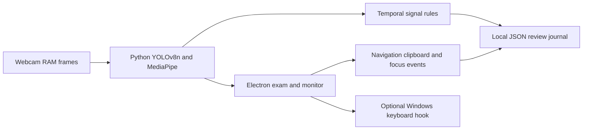

# Local proctoring architecture

The Electron exam window talks to a Python service bound to `127.0.0.1`. The Python worker opens the webcam only after session consent, runs two local models, aggregates sustained signals and saves a metadata report for human review. There are no OpenAI or other cloud inference calls in the application.

## Vision and rules

YOLOv8n detects COCO class 67, `cell phone`; it is used pretrained without fine-tuning. MediaPipe Face Landmarker returns up to three face meshes and head transformation matrices. It supplies face counts; no COCO face detector is claimed. Initial calibration collects 20 single-face frames and takes a median baseline of head/iris features. Relative head yaw/pitch and iris ratios produce a coarse center/down/left/right proxy. Thresholds are prototype defaults; validated accuracy is not established.

Signal thresholds: phone visible 0.8 s; raised phone 1.2 s; no face 3 s; multiple faces 1 s; down/side gaze 3 s. An uninterrupted signal emits once until it clears. A frame gap longer than 2 s resets dwell counters. The raised-phone flag uses bounding-box position/area and cannot prove photography. Reports separate `live` observations and `simulation` signals.

## Exam environment

Electron runs with sandboxing, context isolation and no Node integration in the renderer. The preload exposes only guard state and security notifications. External navigation, redirects and additional windows are denied. Kiosk/always-on-top mode applies during a session; clipboard and selected shortcuts are restricted. Optional Windows keyboard protection uses a low-level hook with no registry changes or process termination.

Recovery: End session; Ctrl+Shift+Q; UI heartbeat watchdog at 20 s; maximum session duration 1 h; hook released on backend shutdown. Ctrl+Alt+Delete is not intercepted. These controls need tests on the target machine. Complete OS lockdown and blocking all outside applications are not claimed. A deployment needs a dedicated exam account and institution-managed OS policies.

## Data and local API boundary

Annotated frames are returned from RAM to the local UI; they are not written to disk. Only session IDs, timestamps, signal metadata, phone boxes/confidence, counts and aggregate observations are logged. No names are required. Local reports remain under `data/` until a human deletes them; the folder is excluded from Git. Video/audio recording, biometrics enrollment and cloud analytics are absent. Downloaded model assets are excluded from Git.

The API uses a per-process random HttpOnly, SameSite=Strict cookie, host validation and origin checks for mutations. No CORS permission is granted to external pages. This reduces browser-based cross-origin misuse; it is not a security boundary against a malicious local process, local administrator or modified application. The application is a single-user prototype with no institutional authentication or signed/tamper-proof evidence log.

## External components and AI disclosure

| Component | Purpose | Primary source |
| --- | --- | --- |
| Ultralytics YOLOv8n and pretrained COCO weights | Phone detection | https://docs.ultralytics.com/modes/predict/ |
| MediaPipe Face Landmarker and pretrained task bundle | Face mesh, iris/head features, face count | https://ai.google.dev/edge/mediapipe/solutions/vision/face_landmarker/python |
| OpenCV, NumPy, CPU PyTorch | Frames, numerical operations, inference | Package manifests / dependency lock |
| FastAPI, Uvicorn, Pydantic | Local service and validation | Package manifests / dependency lock |
| Electron / Chromium | Desktop exam window | https://www.electronjs.org/docs/latest/api/browser-window |
| OpenAI Codex / ChatGPT | Development, documentation, debugging and review | Disclose actual teammate tools before submission |

No custom training dataset or benchmark dataset was collected for this starting build. Any later accuracy claims require a consented, labeled test set with test conditions and sample count. Ultralytics is distributed under AGPL-3.0 (with commercial alternatives); the team must review dependency/model terms before distribution or commercialization. No legal compliance certification is claimed.
